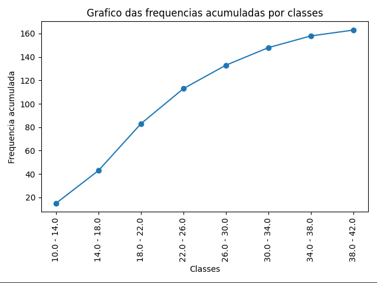

# Análise de Dados Estatísticos

Este é um programa Python que permite realizar análises estatísticas básicas em conjuntos de dados, incluindo cálculo de média, mediana, moda, desvio padrão, variância e coeficiente de variação. Ele também oferece a opção de visualizar um gráfico das frequências acumuladas por classes.

## Funcionalidades

- Cálculo da média, mediana, moda, desvio padrão, variância e coeficiente de variação.
- Geração de um gráfico das frequências acumuladas por classes.
- Visualização de uma tabela com os limites das classes, frequências absolutas e frequências acumuladas.

## Gráfico de Frequências Acumuladas por Classes

Este gráfico representa as frequências acumuladas por classes no conjunto de dados analisado.

## Como Usar

1. Clone este repositório ou baixe o arquivo ZIP.
2. Abra o terminal ou prompt de comando e navegue até o diretório onde o arquivo Python está localizado.
3. Execute o arquivo Python digitando `python nome_do_arquivo.py` (substitua `nome_do_arquivo.py` pelo nome do seu arquivo Python).

Ao executar o programa, você será guiado por mensagens interativas que solicitarão as informações necessárias sobre as classes e os dados estatísticos que você deseja analisar.

## Requisitos

- Python 3.x
- Bibliotecas: functools, tabulate, math, matplotlib

## Notas

- Certifique-se de ter as bibliotecas listadas acima instaladas antes de executar o programa.
- O programa pode ser personalizado e estendido para se adequar às suas necessidades específicas.

## Contribuições

Contribuições são bem-vindas! Se você encontrar algum problema ou quiser adicionar novos recursos, sinta-se à vontade para criar um pull request ou abrir uma issue.